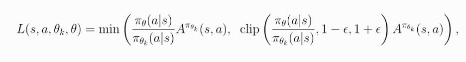

(https://www.youtube.com/watch?v=-teSn9YUOEM)

## Project and Summary
Our project is a duckiebot autonomously driving on a Duckietown environment. We are using Unreal Engine as the environment and we are using reinforcement learning algorithms to maximize the accuracy of actions such that our duckiebot can move around the environment without hitting the outside of the track.

The main idea of our project is to find methods and algorithms to train a duckiebot to drive around the Duckietown track from Unreal Engine such that it doesn’t go out of bounds. The environment consists of a track designed as a lap track with yellow dash lines to indicate a road. Since the environment was rendered from an in-person duckietown track, the outside of the track consists of the room of the duckietown track.

## Approach
The main algorithm that we are using is a Proximal Policy Optimization (PPO) algorithm, a policy gradient method which allows for deep learning in large environments. The library that we are using for PPO is stable_baselines3. We are using a Python Interface to visualize the Duckietown Environment. PPO samples data by the latest data that it is given from the policy. The algorithm will determine the likelihood of an action given the latest state and PPO is therefore an on-policy stochastic method. The data includes the current image of the environment, the velocity given the image, and the position given the image.   Since stable_baselines3 uses PPO-clip, which is a version of PPO that ensures stable policy updates and clips the new and old policies’ probabilities, the idea for the loss function is to limit policy updates such that the training on the duckiebot is stabilized by preventing large updates. Below is the loss function (from OpenAI Spinning Up):
## Evaluation
We conducted extensive training on our PPO (Proximal Policy Optimization) model, accumulating over 1 million training steps. During this process, we recorded key metrics to evaluate the model's performance. The policy gradient loss was -0.00428, and the value loss was 8.28, indicating areas where the model's predictions and policy updates can be further optimized. The learning rate was set to 0.0003 to balance the trade-off between convergence speed and training stability.

In addition to these quantitative metrics, we performed a qualitative assessment of the agent's performance in the Duckietown environment. This included evaluating how often the agent falls off the track, its ability to maintain a straight trajectory, its speed, and its overall navigation behavior. While the agent demonstrated basic lane-following capabilities, there were instances where it struggled with sharp turns or maintaining consistent speed, leading to occasional deviations from the track.

## Remaining Goals and Challenges
Moving forward, we plan to refine the training process and experiment with different reward structures to enhance the agent's decision-making abilities. This will involve optimizing the reward function to encourage smoother navigation, better handling of turns, and improved obstacle avoidance. These adjustments aim to address the current limitations and further improve the agent's performance in the Duckietown environment.

## Resources Used

For our PPO (Proximal Policy Optimization) model, we utilized a Duckietown environment provided by our teaching assistant, JB. In addition to this environment, we leveraged Stable-Baselines3 and PyTorch to develop and train our model.
